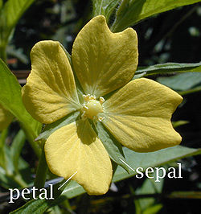
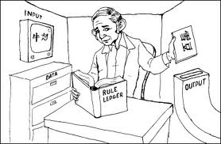

## Synopsis

1. What is Machine Learning? 
2. Some Examples
3. Deep Learning
4. Sum up/ Q&A

--- .class #id 

## What is this?


```{r}
sed <- function(s1, s2) {
    if (nchar(s1) == 0)
        return(nchar(s2))
    if (nchar(s2) == 0)
        return(nchar(s1))

    if (substr(s1, 1, 1) == substr(s2, 1, 1)) {
        sed(substr(s1, 2, nchar(s1)), substr(s2, 2, nchar(s2)))
    }
    else {
        min(1 + sed(substr(s1, 2, nchar(s1)), s2),
        1 + sed(s1, substr(s2, 2, nchar(s2))),
        1 + sed(substr(s1, 2, nchar(s1)), substr(s2, 2, nchar(s2)))
        )
    }
}
```

--- 
## Levenshtein Distance!


```{r}

sed("lars", "lasse")
sed("lars", "lauritz")

```

---
## Levenshtein Distance = Machine Learning

In Frameworks:

1. Python: from leven import levenshtein
2. R: library(stringdist)
3. Java: weka 

---
## In Research


---
## As you shout out in the forest, you are answered!


---


---


---


---


---
## Machine Learning Enables Us To:

1. Predict
2. Explore
3. Visualize
4. Understand

.. with lots of data.

---
## Prediction

Prediction ranges from predicting classes, binary or multiclass, i.e., "should I stay or should I go" vs. "when should I go", if the potential times are discrete.  If they are continuous, we have a regression problem.

A lot (but not arbitrarily much!) context can be taken into account when making these predictions.

Example:
* Objective: "Predict the correct classification of this document."
* Input: "Frequencies of the words used in the document."
* Output: A class (eg., food, sports, finance, etc..)

---
## Exploration

Machine Learning can help us explore a dataset.

*Iris* dataset: 

50 measurements of *sepal length* and *width*, and *petal length* and *width* of 50 flowers of 3 species of Iris, **setosa**, **versicolor**, and **virginica**.



Que?!

---
## Explore: Scatter Plot Matrix (SPLOM)
```{r echo=FALSE}
iris <- datasets::iris
iris2 <- iris[,-5]
species_labels <- iris[,5]
library(colorspace) # get nice colors
species_col <- rev(rainbow_hcl(3))[as.numeric(species_labels)]
```
```{r echo=FALSE}
# Plot a SPLOM:
pairs(iris2, col = species_col,
      lower.panel = NULL,
       cex.labels=2, pch=19, cex = 1.2)

# Add a legend
par(xpd = TRUE)
legend(x = 0.05, y = 0.4, cex = 2,
   legend = as.character(levels(species_labels)),
    fill = unique(species_col))
par(xpd = NA)
```

---
## Visualize: Dendrogram
``` {r echo=FALSE}
d_iris <- dist(iris2) # method="man" # is a bit better
hc_iris <- hclust(d_iris, method = "complete")
iris_species <- rev(levels(iris[,5]))

library(dendextend)
dend <- as.dendrogram(hc_iris)
# order it the closest we can to the order of the observations:
dend <- rotate(dend, 1:150)

# Color the branches based on the clusters:
dend <- color_branches(dend, k=3) #, groupLabels=iris_species)

# Manually match the labels, as much as possible, to the real classification of the flowers:
labels_colors(dend) <-
   rainbow_hcl(3)[sort_levels_values(
      as.numeric(iris[,5])[order.dendrogram(dend)]
   )]

# We shall add the flower type to the labels:
labels(dend) <- paste(as.character(iris[,5])[order.dendrogram(dend)],
                           "(",labels(dend),")", 
                           sep = "")
# We hang the dendrogram a bit:
dend <- hang.dendrogram(dend,hang_height=0.1)
# reduce the size of the labels:
# dend <- assign_values_to_leaves_nodePar(dend, 0.5, "lab.cex")
dend <- set(dend, "labels_cex", 0.5)
# And plot:
par(mar = c(3,3,3,7))
plot(dend, 
     main = "Clustered Iris data set
     (the labels give the true flower species)", 
     horiz =  TRUE,  nodePar = list(cex = .007))
legend("topleft", legend = iris_species, fill = rainbow_hcl(3))
```

---
## Or Possibly This?
```{r echo=FALSE}
# Requires that the circlize package will be installed
par(mar = rep(0,4))
circlize_dendrogram(dend)
```

---
## Understanding?

Inference can help us understand. 

```{r echo=FALSE, warnings=FALSE, errors=FALSE, warning=FALSE}
library(ggplot2)

qplot(wt, mpg, data=mtcars, geom=c("point", "smooth"),
      method="lm", formula=y~x,
      main="Regression of MPG on Weight",
      xlab="Weight", ylab="Miles per Gallon")
```


---
## The Effect of Cylinders
```{r echo=FALSE, warnings=FALSE, errors=FALSE, warning=FALSE}
qplot(wt, mpg, data=mtcars, geom=c("point", "smooth"),
      method="lm", formula=y~x, color=cyl,
      main="Regression of MPG on Weight",
      xlab="Weight", ylab="Miles per Gallon")
```


---
## Why Would We Want To Do This?!

McKinsey Global Institute (2011) predicted the importance of Big Data/Data Science/Machine Learning:
http://www.mckinsey.com/business-functions/digital-mckinsey/our-insights/big-data-the-next-frontier-for-innovation

> The McKinsey Global Institute argues that data analytics is emerging at the forefront as the competitive advantage of any business, driving productivity, growth and innovation. 

A human being can not read thens of thousands of document per day, let alone per hour, minute or second.  Computers can! (Or can they?!)

---
## Digression: The Chinese Room (John Searle)




---
## More Concretely (Finally!)

1. Supervised Learning
2. Unsupervised Learning
3. Semi-Supervised Learning
4. Active Learning

---
## Supervised Learning

Supervision means that the algorithms are instructed.

Example:
Objective: Determine the spamicity of emails.
Input: A corpus of emails tagged as spam and ham. 
Output: Spam/Ham

The computerized model learns *weights* that are multiplied with *features* generated from emails to determine their status. Thus, the model can be applied to novel (new) data.

---
## Unsupervised Learning

Algorithms are not provided a set of goals they are to reach.

An example is the hierarchical clustering shown above.

--- 
## Example Algorithms

### Naive Bayes Classification:

Under the assumption of conditional independence, the probability of a class is distributed as:

$$
\begin{align}
p(C_k \mid x_1, \dots, x_n) & \varpropto p(C_k, x_1, \dots, x_n) \\
& \varpropto p(C_k) \ p(x_1 \mid C_k) \ p(x_2\mid C_k) \ p(x_3\mid C_k) \ \cdots \\
                            & \varpropto p(C_k) \prod_{i=1}^n p(x_i \mid C_k)\,.
\end{align}
$$
Finding the best class:

$$ \hat{y} = \underset{k \in \{1, \dots, K\}}{\operatorname{argmax}} \ p(C_k) \displaystyle\prod_{i=1}^n p(x_i \mid C_k).$$

---
## NB Calculation
  
  ```{r echo=FALSE}
foo<-"1
Red
Sports
Domestic
Yes
2
Red
Sports
Domestic
No
3
Red
Sports
Domestic
Yes
4
Yellow
Sports
Domestic
No
5
Yellow
Sports
Imported
Yes
6
Yellow
SUV
Imported
No
7
Yellow
SUV
Imported
Yes
8
Yellow
SUV
Domestic
No
9
Red
SUV
Imported
No
10
Red
Sports
Imported
Yes";
bar <- matrix(strsplit(foo,"\n")[[1]], nrow=10, byrow=TRUE);
colnames(bar) <- c("No", "Color", "Type", "Origin", "Stolen");
bar
```

$$
P(Yes|Red, Sports, Domestic) = P(Yes)*P(Red|Yes)*P(Sports|Yes)*P(Domestic|Yes) \\
P(No|Red, Sports, Domestic) = P(No)*P(Red|No)*P(Sports|No)*P(Domestic|No)
$$

