## Synopsis

1. What is Machine Learning? 
2. Some Examples
3. Deep Learning
4. Sum up/ Q&A

--- .class #id 

## What is this?


```r
sed <- function(s1, s2) {
    if (nchar(s1) == 0)
        return(nchar(s2))
    if (nchar(s2) == 0)
        return(nchar(s1))

    if (substr(s1, 1, 1) == substr(s2, 1, 1)) {
        sed(substr(s1, 2, nchar(s1)), substr(s2, 2, nchar(s2)))
    }
    else {
        min(1 + sed(substr(s1, 2, nchar(s1)), s2),
        1 + sed(s1, substr(s2, 2, nchar(s2))),
        1 + sed(substr(s1, 2, nchar(s1)), substr(s2, 2, nchar(s2)))
        )
    }
}
```

--- 
## Levenshtein Distance!


```r
sed("lars", "lasse")
```

```
## [1] 2
```

```r
sed("lars", "lauritz")
```

```
## [1] 4
```

---
## Levenshtein Distance = Machine Learning

In Frameworks:

1. Python: from leven import levenshtein
2. R: library(stringdist)
3. Java: weka 

---
## In Research

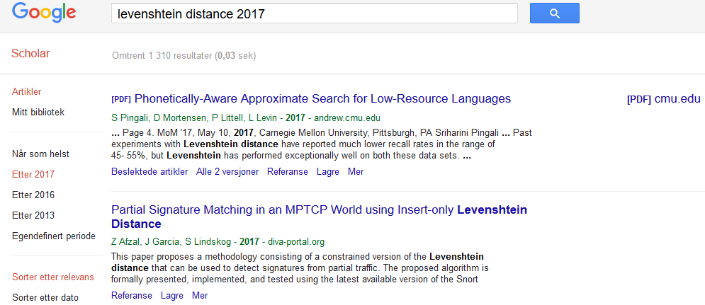

---
## As you shout out in the forest, you are answered!

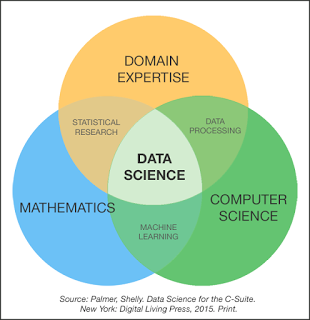

---
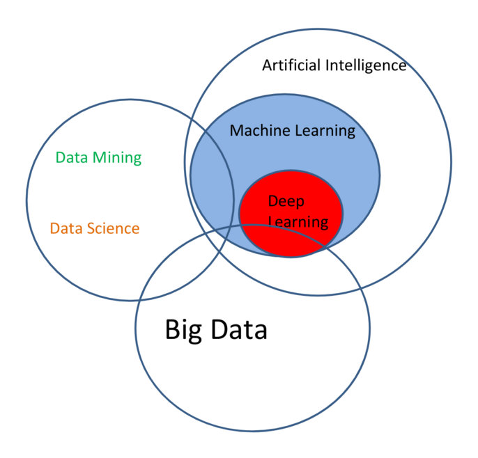

---
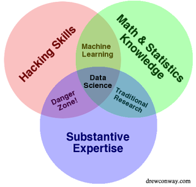

---
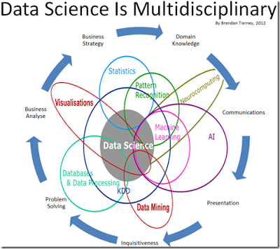

---


---
## Machine Learning Enables Us To:

1. Predict
2. Explore
3. Visualize
4. Understand

.. with lots of data.

Data-driven approaches learn from data (bottom-up) as opposed to coming up with rules and applying them to data (top-down).

---
## Prediction

Prediction ranges from predicting classes, binary or multiclass, i.e., "should I stay or should I go" vs. "when should I go" -- if the potential times are discrete.  If they are continuous, we have a regression problem.

A lot (but not arbitrarily much!) context can be taken into account when making these predictions.

Example:
* Objective: "Predict the correct class of this document."
* Input: "Frequencies of the words used in the document."
* Output: A class (eg., food, sports, finance, etc..)

---
## Exploration

Machine Learning can help us explore a dataset.

*Iris* dataset: 

50 measurements of *sepal length* and *width*, and *petal length* and *width* of 50 flowers of 3 species of Iris; **setosa**, **versicolor**, and **virginica**.


Que?!

---
## Explore: Scatter Plot Matrix (SPLOM)

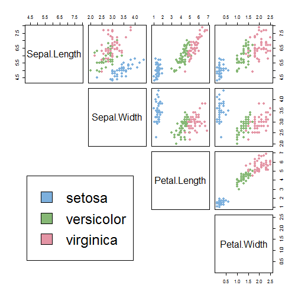

---
## Visualize: Dendrogram
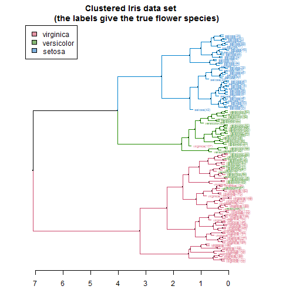

---
## Or Possibly This?
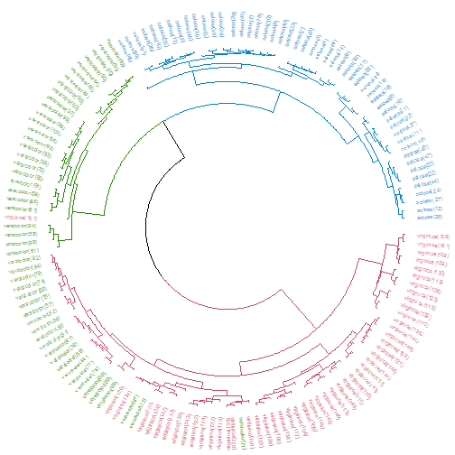

---
## Understanding?

Inference can help us understand. 

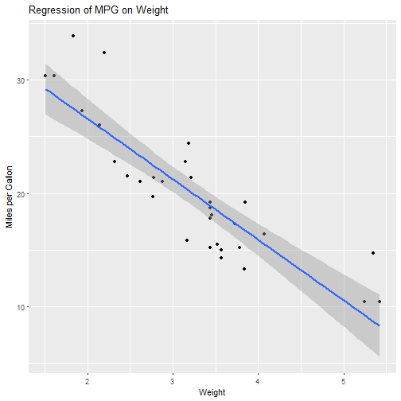


---
## The Effect of Cylinders
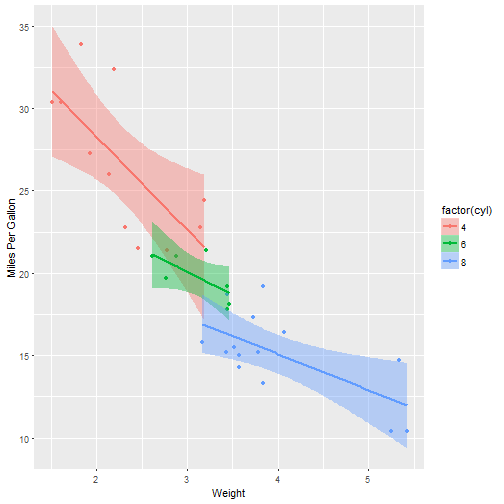


---
## Why Would We Want To Do This?!

McKinsey Global Institute (2011) predicted the importance of Big Data/Data Science/Machine Learning:
http://www.mckinsey.com/business-functions/digital-mckinsey/our-insights/big-data-the-next-frontier-for-innovation

> The McKinsey Global Institute argues that data analytics is emerging at the forefront as the competitive advantage of any business, driving productivity, growth and innovation. 

A human being can not read thens of thousands of document per day, let alone per hour, minute or second.  Computers can! (Or can they?!)

---
## Digression: The Chinese Room (John Searle)

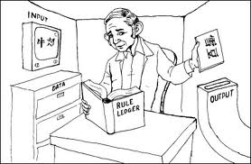


---
## More Concretely (Finally!)

1. Supervised Learning
2. Unsupervised Learning
3. Semi-Supervised Learning
4. Active Learning

---
## Supervised Learning

Supervision means that the algorithms are instructed.  More technically, a function is inferred from labeled data.

Example:

* Objective: Determine the spamicity of emails.
* Input: A corpus of emails tagged as spam and ham. 
* Output: A class {Spam, Ham}

The computerized model learns *weights* that are multiplied with *features* generated from emails to determine their status. Thus, the model can be applied to novel (new) data.

---
## Unsupervised Learning

Algorithms are not provided a set of goals they are to reach.

An example is the hierarchical clustering shown above.

Idea: run an algorithm on data and infer relations in the data in another (lower) dimension based on shared properties.  This can result, for instance, in a clustering which groups similar objects together.

Patterns can be discovered (such as topics in a document colletion) or input lower-dimensional representations of instances.

--- 
## Example Algorithm

### Naive Bayes Classification:

Under the assumption of conditional independence, the probability of a class $k$ is expresed as:

$$
\begin{align}
p(C_k \mid x_1, \dots, x_n) & \varpropto p(C_k, x_1, \dots, x_n) \\
& \varpropto p(C_k) \ p(x_1 \mid C_k) \ p(x_2\mid C_k) \ p(x_3\mid C_k) \ \cdots \\
                            & \varpropto p(C_k) \prod_{i=1}^n p(x_i \mid C_k)\,.
\end{align}
$$
Finding the best class:

$$ \hat{y} = \underset{k \in \{1, \dots, K\}}{\operatorname{argmax}} \ p(C_k) \displaystyle\prod_{i=1}^n p(x_i \mid C_k).$$

---
## NB Calculation
  
  
  ```
  ##       No   Color    Type     Origin     Stolen
  ##  [1,] "1"  "Red"    "Sports" "Domestic" "Yes" 
  ##  [2,] "2"  "Red"    "Sports" "Domestic" "No"  
  ##  [3,] "3"  "Red"    "Sports" "Domestic" "Yes" 
  ##  [4,] "4"  "Yellow" "Sports" "Domestic" "No"  
  ##  [5,] "5"  "Yellow" "Sports" "Imported" "Yes" 
  ##  [6,] "6"  "Yellow" "SUV"    "Imported" "No"  
  ##  [7,] "7"  "Yellow" "SUV"    "Imported" "Yes" 
  ##  [8,] "8"  "Yellow" "SUV"    "Domestic" "No"  
  ##  [9,] "9"  "Red"    "SUV"    "Imported" "No"  
  ## [10,] "10" "Red"    "Sports" "Imported" "Yes"
  ```

$$
P(Yes|Red, Sports, Dom) = P(Yes)*P(Red|Yes)*P(Sports|Yes)*P(Dom|Yes) \\
P(No|Red, Sports, Dom) = P(No)*P(Red|No)*P(Sports|No)*P(Dom|No)
$$

---
## Semi-Supervised Learning

Example:

We have some data which is tagged (**Dow Jones Newswires**) but other data that is untagged (**other feeds**).

Tagging of the other data is then, strictly speaking, not a supervised task because we do not have any supervision on the data we are actually tagging.

A recurring problem in all data-driven approaches; train a model on some data (text about food), apply it to other data (text about finance).

---
## Active Learning

Select some, mis-classified instances, correct them and feed them back into the loop.

This can also be referred to as reinforcement learning or on-line learning whereby the algorithm can learn from mistakes.

Has been shown to improve training time as you need less data to converge to the maximum performance.

---
## Infront and Machine Learning

For the Company:
* Business Intelligence (predict sales, new/old? customers, synergies between countries, marketing impact, etc.)
* Support (load prediction, FAQ creation, chatbots, etc.)
* Intrusion Detection (who is knocking on our door?)
* Sentiment Analysis (how do people feel about #infront on Twitter?)

For the Customers:
* Recommendation of (products, news, stocks?!)
* Text Summarization (what's the essence of this document/document collection)
* Topic Discovery (what are people talking about?)
* Voice APIs (play text, recognize voice)
* +++


---
## Conclusion 

* Machine Learning can be pervasive through the organization
* It is a helpful tool (your friend)
* Methods, algorithms, platforms are increasingly available
* Frameworks make it easier to deploy (e.g., try many algorithms in parallel)
