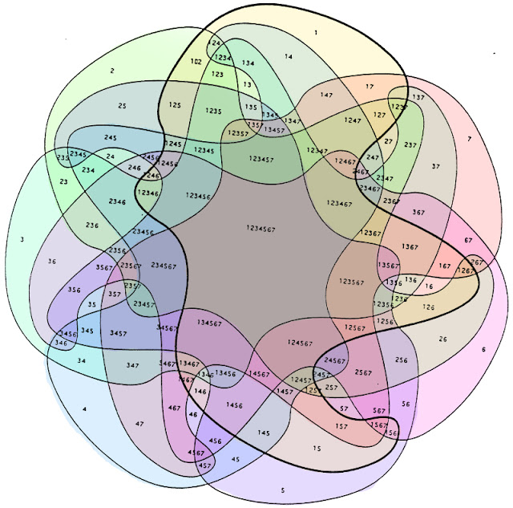

## Synopsis

1. What is Machine Learning? 
2. Some Examples
3. Deep Learning
4. Sum up/ Q&A

--- .class #id 

## What is this?


```r
sed <- function(s1, s2) {
    if (nchar(s1) == 0)
        return(nchar(s2))
    if (nchar(s2) == 0)
        return(nchar(s1))

    if (substr(s1, 1, 1) == substr(s2, 1, 1)) {
        sed(substr(s1, 2, nchar(s1)), substr(s2, 2, nchar(s2)))
    }
    else {
        min(1 + sed(substr(s1, 2, nchar(s1)), s2),
        1 + sed(s1, substr(s2, 2, nchar(s2))),
        1 + sed(substr(s1, 2, nchar(s1)), substr(s2, 2, nchar(s2)))
        )
    }
}
```

--- 
## Levenshtein Distance!


```r
sed("lars", "lasse")
```

```
## [1] 2
```

```r
sed("lars", "lauritz")
```

```
## [1] 4
```

---
## Levenshtein Distance = Machine Learning

In Frameworks:

1. Python: from leven import levenshtein
2. R: library(stringdist)
3. Java: weka 

---
## In Research


---
## As you shout out in the forest, you are answered!


---


---


---


---


---
## Machine Learning Enables Us To:

1. Predict
2. Explore
3. Visualize
4. Understand

.. with lots of data.

---
## Prediction

Prediction ranges from predicting classes, binary or multiclass, i.e., "should I stay or should I go" vs. "when should I go", if the potential times are discrete.  If they are continuous, we have a regression problem.

A lot (but not arbitrarily much!) context can be taken into account when making these predictions.

Example:
* Objective: "Predict the correct classification of this document."
* Input: "Frequencies of the words used in the document."
* Output: A class (eg., food, sports, finance, etc..)

---
## Exploration

Machine Learning can help us explore a dataset.

*Iris* dataset: 

50 measurements of *sepal length* and *width*, and *petal length* and *width* of 50 flowers of 3 species of Iris, **setosa**, **versicolor**, and **virginica**.


Que?!

---
## Explore: Scatter Plot Matrix (SPLOM)


---
## Visualize: Dendrogram


---
## Or Possibly This?


---
## Understanding

---
## Why Would We Want To Do This?!

McKinsey Global Institute (2011) predicted the importance of Big Data/Data Science/Machine Learning:
http://www.mckinsey.com/business-functions/digital-mckinsey/our-insights/big-data-the-next-frontier-for-innovation

> The McKinsey Global Institute argues that data analytics is emerging at the forefront as the competitive advantage of any business, driving productivity, growth and innovation. 

A human being can not read thens of thousands of document per day, let alone per hour, minute or second.  Computers can! (Or can they?!)

---
## Digression: The Chinese Room (John Searle)


---
## More Concretely (Finally!)

1. Supervised Learning
2. Unsupervised Learning
3. Semi-Supervised Learning
4. Active Learning

---
## Supervised Learning

Supervision means that the algorithms are instructed.

Example:
Objective: Determine the spamicity of emails.
Input: A corpus of emails tagged as spam and ham. 
Output: Spam/Ham

The computerized model learns *weights* that are multiplied with *features* generated from emails to determine their status. Thus, the model can be applied to novel (new) data.

---
## Unsupervised Learning

Algorithms are not provided a set of goals they are to reach.

-- 
## Example Algorithms

Naive Bayes Classification
